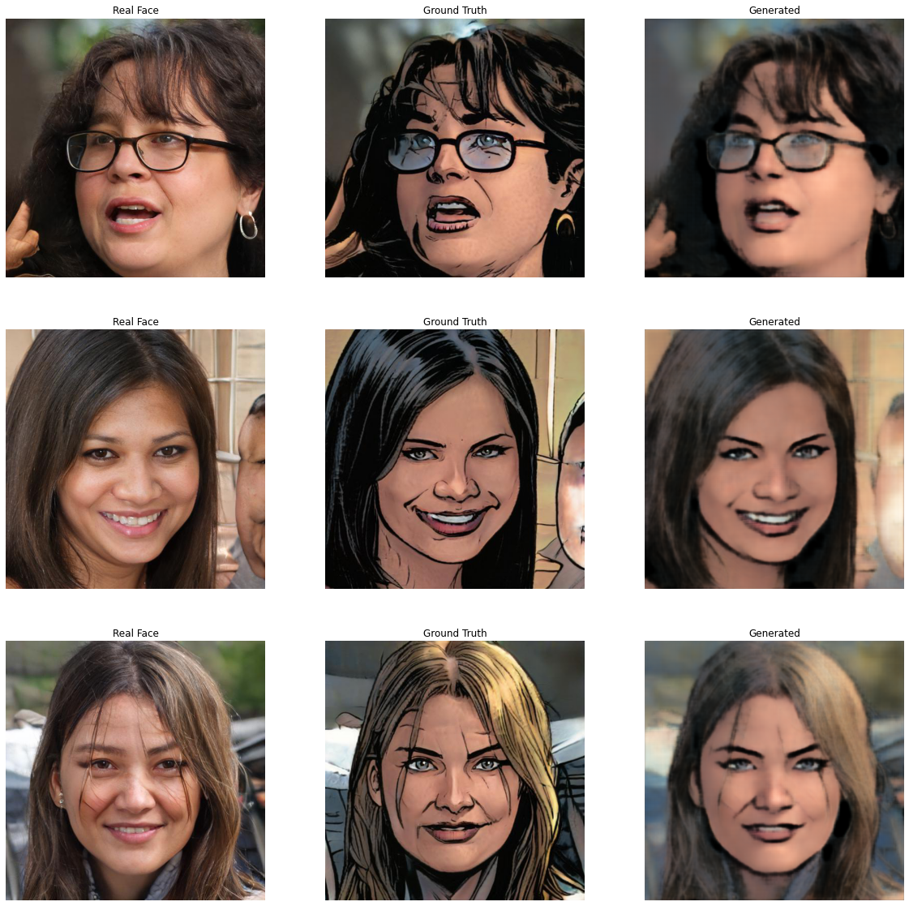
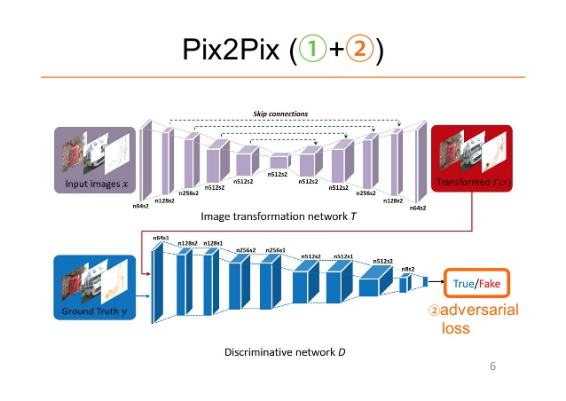

[![Contributors][contributors-shield]][contributors-url]
[![Forks][forks-shield]][forks-url]
[![Stargazers][stars-shield]][stars-url]
[![Issues][issues-shield]][issues-url]
[![MIT License][license-shield]][license-url]
[![LinkedIn][linkedin-shield]][linkedin-url]
<!-- [![image title][views-url] -->

# Cartoonify

Pytorch Implementation [Translating Real Images to cartoon images using PIX2PIX - Image-to-Image Translation with Conditional Adversarial Networks](https://arxiv.org/abs/1611.07004) Phillip Isola, Jun-Yan Zhu, Tinghui Zhou, Alexei A. Efros

<p align="center">

</p>
<br>
<br>

## Abstract
<br>

We investigate conditional adversarial networks as a
general-purpose solution to image-to-image translation
problems. These networks not only learn the mapping from
input image to output image, but also learn a loss function to train this mapping. This makes it possible to apply
the same generic approach to problems that traditionally
would require very different loss formulations. We demonstrate that this approach is effective at synthesizing photos
from label maps, reconstructing objects from edge maps,
and colorizing images, among other tasks. Indeed, since the
release of the pix2pix software associated with this paper, a large number of internet users (many of them artists)
have posted their own experiments with our system, further
demonstrating its wide applicability and ease of adoption
without the need for parameter tweaking. As a community, we no longer hand-engineer our mapping functions,
and this work suggests we can achieve reasonable results
without hand-engineering our loss functions either
<br>
<br>


## Architecture
<br>
<p align="center">

</p>

<br>

## Directory Structre

```
.
├── assets
├── data
├── docs
├── logs
├── pipelines
├── research
├── src
│   ├── data
│   └── models
│   └── utils
├── tests
├── weights
├── LICENSE
├── README.md
├── requirements.txt
|── train.py
└── inference.py


```

## Run Training

```sh
python train.py \
    --wandbkey={{WANDB KEY}} \
    --projectname=Cartoonify \
    --wandbentity={{WANDB USERNAME}} \
    --tensorboard=True \
    --kaggle_user={{KAGGLE USERNAME}} \
    --kaggle_key={{KAGGLE API KEY}} \
    --batch_size=2 \
    --epoch=5 \
    --load_checkpoints=True \
```


## References
1. **Phillip Isola, Jun-Yan Zhu, Tinghui Zhou, Alexei A. Efros.** *Image-to-Image Translation with Conditional Adversarial Networks.*[[arxiv](https://arxiv.org/abs/1611.07004)]
2. **Ian Goodfellow, Jean Pouget-Abadie, Mehdi Mirza, Bing Xu, David Warde-Farley, 
Sherjil Ozair, Aaron Courville, Yoshua Bengio.** *Generative adversarial nets.* NIPS 2014 [[arxiv](https://arxiv.org/abs/1406.2661)]
3. **Ian Goodfellow.** *Tutorial: Generative Adversarial Networks.* NIPS 2016 [[arxiv](https://arxiv.org/abs/1701.00160)]
5. PyTorch Docs. [https://pytorch.org/docs/stable/index.html]


<!-- MARKDOWN LINKS & IMAGES --> 
<!-- https://www.markdownguide.org/basic-syntax/#reference-style-links -->
[contributors-shield]: https://img.shields.io/github/contributors/rohitkuk/Cartoonify.svg?style=for-the-badge
[contributors-url]: https://github.com/rohitkuk/Cartoonify/graphs/contributors
[views-url]: https://github.com/rohitkuk/Cartoonify/graphs/traffic
[forks-shield]: https://img.shields.io/github/forks/rohitkuk/Cartoonify.svg?style=for-the-badge
[forks-url]: https://github.com/rohitkuk/Cartoonify/network/members
[stars-shield]: https://img.shields.io/github/stars/rohitkuk/Cartoonify.svg?style=for-the-badge
[stars-url]: https://github.com/rohitkuk/Cartoonify/stargazers
[issues-shield]: https://img.shields.io/github/issues/rohitkuk/Cartoonify.svg?style=for-the-badge
[issues-url]: https://github.com/rohitkuk/Cartoonify/issues
[license-shield]: https://img.shields.io/github/license/rohitkuk/Cartoonify.svg?style=for-the-badge
[license-url]: https://github.com/rohitkuk/Cartoonify/blob/master/LICENSE.txt
[linkedin-shield]: https://img.shields.io/badge/-LinkedIn-black.svg?style=for-the-badge&logo=linkedin&colorB=555
[linkedin-url]: https://linkedin.com/in/rohitkuk
[product-screenshot]: images/screenshot.png